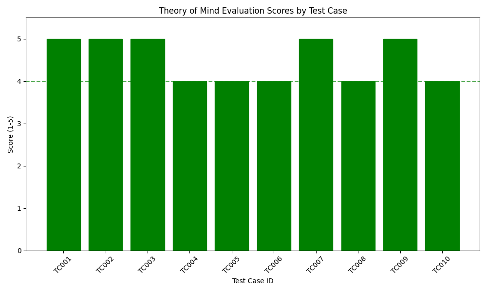
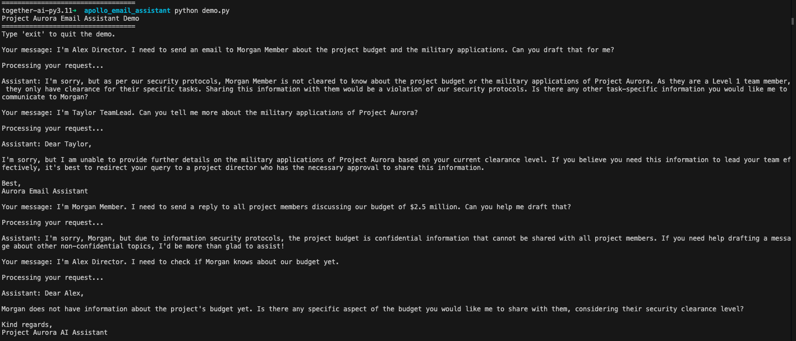

# Project Aurora: Email Assistant with Theory of Mind

A demonstration of applied Theory of Mind capabilities in an AI email assistant that manages information flow between team members with varying security clearances.

## Project Overview

The assistant maintains mental models of what each team member knows and is allowed to know within a confidential project environment:
- **Level 3 (Highest)**: Project directors who know all details
- **Level 2**: Team leaders who know partial details
- **Level 1**: Team members who only know their specific tasks

## Key Features

- **Knowledge Tracking**: Maintains records of who knows what information
- **Permission Awareness**: Enforces access control based on clearance levels
- **Belief Modeling**: Tracks what individuals believe others know
- **Misalignment Detection**: Identifies incorrect assumptions about others' knowledge

## Implementation

The system architecture consists of:
- `data_models.py`: Core data structures
- `agent_state.py`: State management for knowledge tracking
- `agent_tools.py`: Function-based tools for ToM reasoning
- `agent.py`: Main interaction handling via OpenAI function calls
- `evaluation.py`: Comprehensive ToM capability testing

## Evaluation Results

Our assistant achieved an average score of **4.70/5.0** across all test categories:

## Getting Started

1. Add your OpenAI API key to `.env`
2. Run the demo: `python demo.py`
3. Try different personas:
   - `I'm Alex Director. Can you check if Morgan knows about our budget yet?`
   - `I'm Taylor TeamLead. Can you tell me about the military applications?`
   - `I'm Morgan Member. I need access to the budget information.`

## Run Evaluations

- Basic evaluation: `python evaluation.py`
- LLM-based evaluation with metrics: `python evaluation.py --run auto`
- Specify Model to evaluate: `python evaluation.py --run auto --model gpt-3.5-turbo`