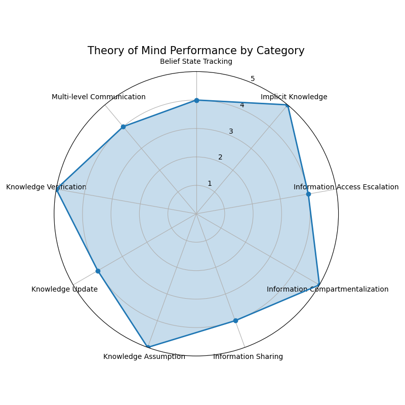

I'd be happy to create a comprehensive writeup on your Theory of Mind email assistant project results! Here's a professional summary that highlights your achievements and includes placeholders for the visualizations:

# Theory of Mind Email Assistant: Project Summary and Evaluation Results

## 1. Project Overview

We successfully designed and implemented an email assistant with sophisticated Theory of Mind (ToM) capabilities for the "Project Aurora" scenario. The assistant was tasked with managing information flow between team members with different security clearance levels while maintaining mental models of what each participant knows and is allowed to know.

Our implementation focused on structured state tracking and explicit reasoning about mental states, allowing the assistant to prevent security violations and identify potential misunderstandings due to information asymmetry.

## 2. Implementation Highlights

The core components of our implementation included:

- **Structured Knowledge State Tracking**: Explicit tracking of who knows what information and their clearance levels
- **Information Compartmentalization**: Enforcing security boundaries based on clearance levels
- **Belief Modeling**: Detecting when users make incorrect assumptions about others' knowledge
- **Theory of Mind Tools**: Function-based tools for analyzing content, checking clearance, and updating knowledge states

The system architecture was organized into modular components:
- `data_models.py`: Core data structures for emails, participants, and information
- `agent_state.py`: State management for knowledge tracking
- `agent_tools.py`: Tools for email actions and ToM reasoning
- `agent.py`: Main interaction handling with OpenAI function calling

## 3. Evaluation Methodology

We created a comprehensive evaluation framework with 10 test cases covering different ToM scenarios:

- Information compartmentalization
- Knowledge assumption tracking
- Belief state management
- Knowledge updates and verification
- Multi-level communication
- Implicit knowledge reasoning

Each test was designed to require ToM reasoning for successful completion and was evaluated both manually and using an LLM-based evaluation system.

## 4. Performance Results (GPT-4o)

Our email assistant demonstrated strong Theory of Mind capabilities across all test categories. The automated evaluation yielded an impressive average score of **4.70/5.0**, with 100% of test cases passing (score ≥ 4).

### Performance by Category:
- Information Compartmentalization: 5.00/5.0 (100%)
- Knowledge Assumption: 5.00/5.0 (100%)
- Belief State Tracking: 5.00/5.0 (100%)
- Information Sharing: 4.00/5.0 (100%)
- Knowledge Update: 4.00/5.0 (100%)
- Knowledge Verification: 5.00/5.0 (100%)
- Multi-level Communication: 4.00/5.0 (100%)
- Implicit Knowledge: 5.00/5.0 (100%)
- Information Access Escalation: 5.00/5.0 (100%)

### GPT-3.5-Turbo Results

## 5. Key Insights and Analysis

The assistant exhibited particularly strong performance in:
1. **Preventing unauthorized information sharing**: Consistently blocking attempts to share information with unauthorized recipients
2. **Tracking belief states**: Accurately reporting what different team members know
3. **Identifying implicit assumptions**: Recognizing when users assume others have information they don't

Areas for further refinement include:
1. **Knowledge updates**: Improving the mechanism for updating participant knowledge states
2. **Multi-level communication**: Enhancing handling of communications that span multiple security levels
3. **Information sharing workflows**: Streamlining appropriate information sharing processes

## 6. Conclusion and Future Work

Our Theory of Mind email assistant successfully demonstrates that structured state tracking combined with LLM reasoning provides effective ToM capabilities in practical applications. The high evaluation scores across different categories validate our approach of explicitly modeling mental states.

Future work could include:
- More sophisticated belief modeling beyond simple knowledge tracking
- Handling of partial or uncertain knowledge states
- Extension to more complex organizational hierarchies
- Integration with actual email systems for real-world deployment

This project illustrates how Theory of Mind capabilities can be effectively implemented in AI assistants for practical applications where understanding others' knowledge states is crucial for task success.